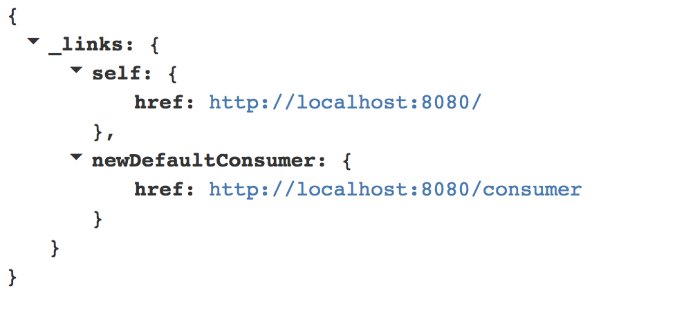

# Kafka Browser

Browse your Kafka Topics.

[](https://travis-ci.org/markush81/kafka-browser) [](https://sonarcloud.io/dashboard?id=markush81.net.mh.kafkabrowser)

***EARLY BETA PHASE***

Adjust `src/main/resources/application.yml`.

```
./gradlew bootRun
```

[http://localhost:8080](http://localhost:8080)

Just follow the [HAL](https://en.wikipedia.org/wiki/Hypertext_Application_Language) links.



Examples:

1. Create a `<Long,String>` Topic Browser

```
curl -XPOST -H "Content-Type:application/json" -d @requests/consumer_LS.txt http://localhost:8080/consumer
```